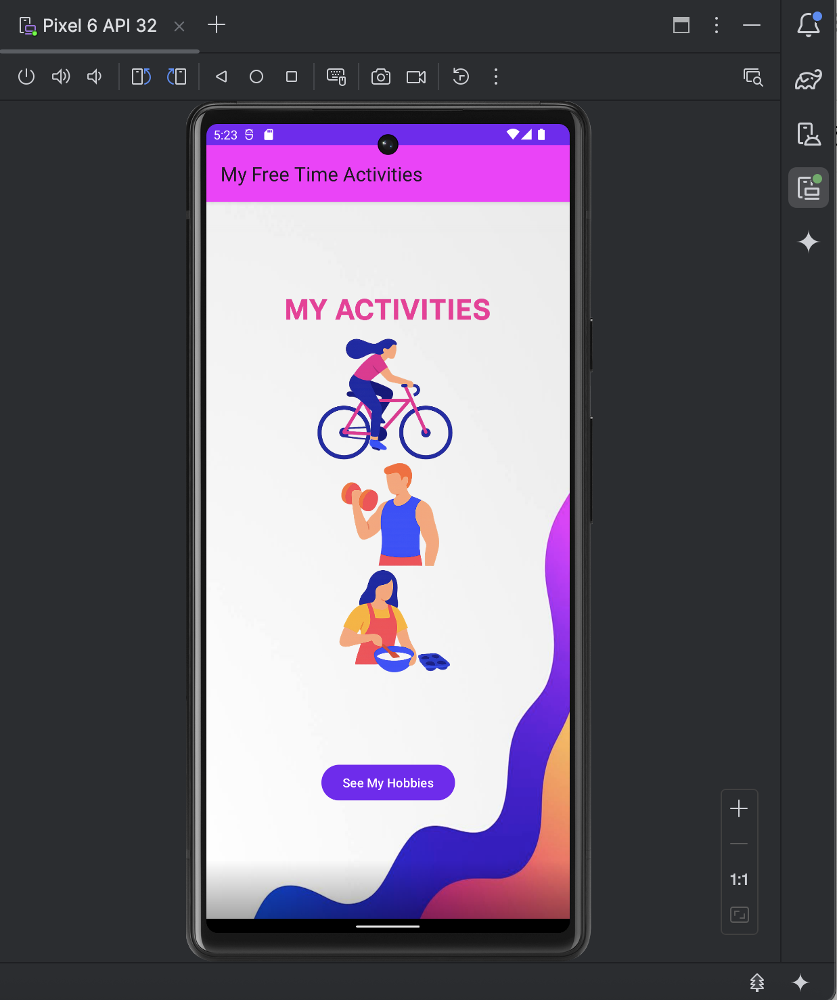
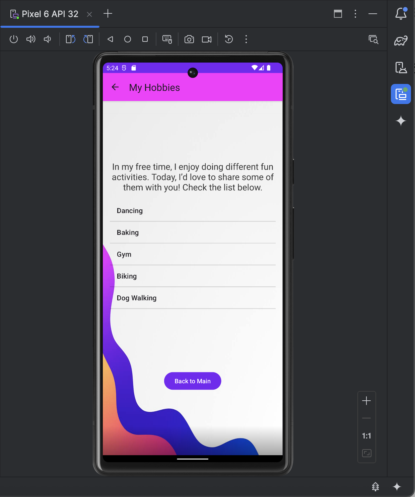
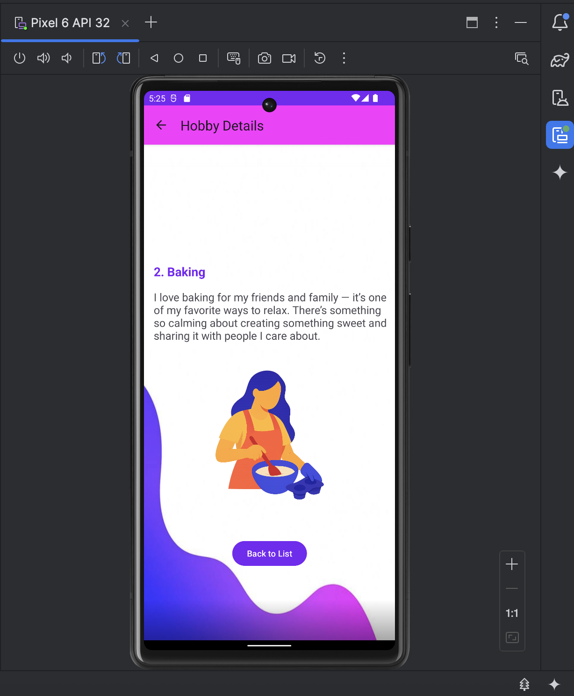
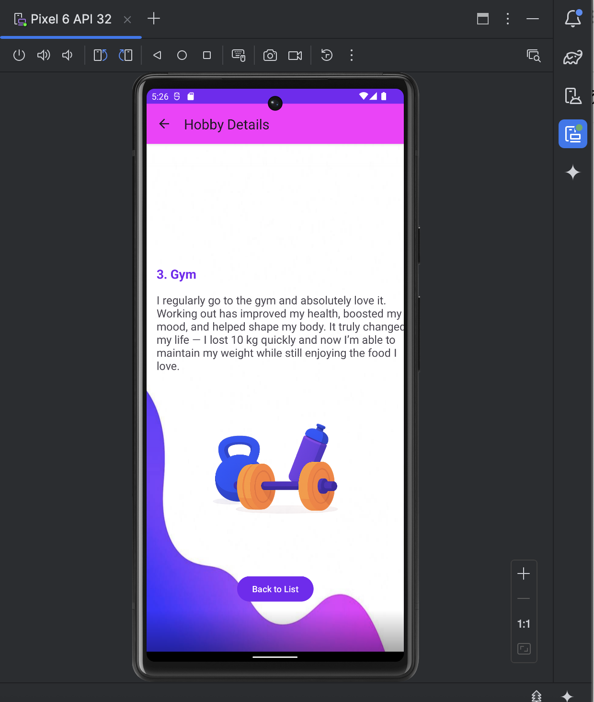
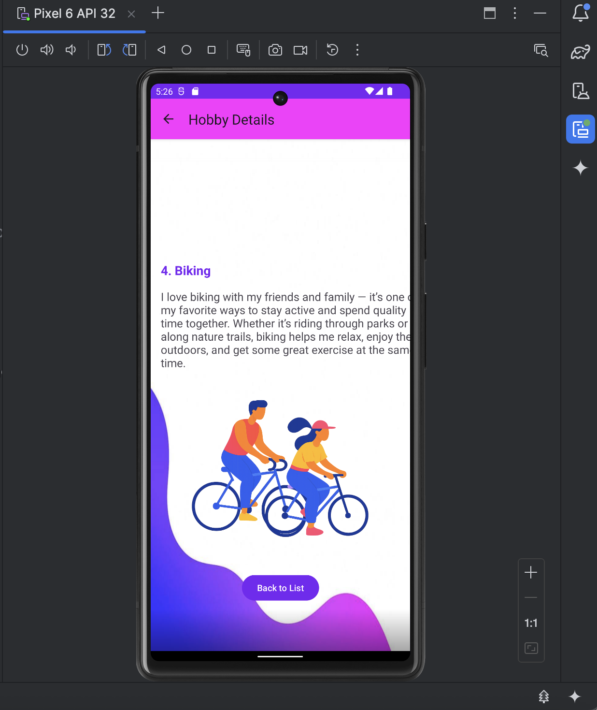
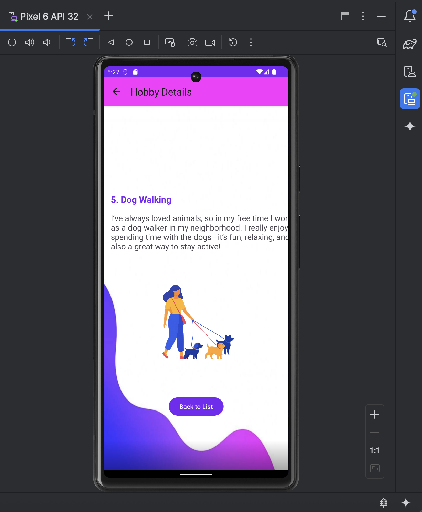

# 🎨 My Free Time Activities — DAO Version

My Free Time Activities is an Android app that displays a collection of hobbies I enjoy in my free time.  
Each hobby includes a name, a detailed personal description, and a themed illustration.  
This **DAO version** uses the **Room persistence library** to store hobby data locally on the device.

All illustrations and background artwork were **created by me using AI**, and I chose the color palette myself to match the app’s visual theme.

---

## ✨ Features

- 🏠 **Main Screen** with a custom-designed, AI-generated illustration  
- 📋 **List of Activities** loaded from a pre-populated Room database  
- 📄 **Detail Pages** for each hobby, showing personalized descriptions + custom illustrations  
- 🔙 **Navigation Buttons** to return to the hobby list  
- 💾 **Local Data Storage** using Room DAO (no internet needed)  
- 🎨 **Custom visuals**: color theme, background, and illustrations created using AI

---

## 🖼️ Screenshots

### 1. Main Screen  

### 2. Hobbies List  

### 3. Hobby Details — Dancing  

### 4. Hobby Details — Baking  

### 5. Hobby Details — Gym  

### 6. Hobby Details — Biking  

### 7. Hobby Details — Dog Walking  

---

## 🧠 How It Works

### 📦 Room Database (Pre-Populated)
The app uses a local Room database (`HobbyDatabase`) that is automatically filled with **five hobbies** on first launch:
- Dancing  
- Baking  
- Gym  
- Biking  
- Dog Walking  

### 🛠 DAO (Data Access Object)
`HobbyDao` exposes:
- `getAllHobbies()` — LiveData list  
- `getHobbyById(id)` — Fetch one hobby  
- `insertAll()` — Pre-population  

### 📚 Repository
`HobbyRepository` provides a clean API between the database and ViewModels.

### 🧭 ViewModel
`HobbyViewModel` supplies:
- `allHobbies`
- `getHobbyById(id)`

All retrieved as **LiveData** for automatic UI updates.

### 🖥 UI Structure
- **MainActivity** → Shows “See My Hobbies” button  
- **HobbyListActivity** → Displays list of hobbies  
- **HobbyDetailActivity** → Shows detailed hobby information + "Back to List" button  

---
